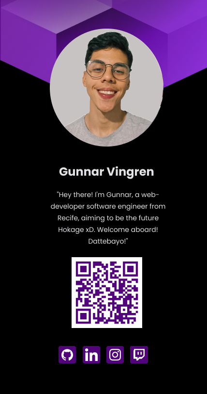

---

# Badge Virtual 🏷️👤

Bem-vindos ao meu badge virtual! 🤗 Eu sou Gunnar Vingren, desenvolvedor web e engenheiro de software de Recife. Este projeto é como um distintivo online, onde compartilho informações sobre mim e links para minhas redes sociais. A ideia é praticar boas práticas de CSS, utilizando pseudo-classes como `:is` e `:not`, além de uma abordagem mobile-first para uma ótima experiência em todos os dispositivos. Vamos explorar! 🔎

## Destaques do Projeto ✨

### Uso Avançado de Pseudo-Classes 🎨
- **`:is` para Simplificar Estilos**: Esta pseudo-classe permite agrupar seletores, reduzindo a repetição de código e facilitando a manutenção.
- **`:not` para Exceções**: Com esta pseudo-classe, é possível aplicar estilos mais complexos com controle adicional, evitando regras em elementos específicos.

### Design Mobile-First 📱
- **Estrutura Responsiva**: O projeto foi construído com uma abordagem mobile-first, garantindo uma experiência suave em dispositivos móveis e desktops.
- **Visual Atraente**: O plano de fundo dinâmico e a estrutura responsiva mantêm o badge virtual moderno e amigável, adaptando-se a diferentes tamanhos de tela.

### Conexão com Redes Sociais 🔗
- **Links para Redes Sociais**: Conecte-se comigo no GitHub, LinkedIn, Instagram e Twitch através dos links incluídos no projeto.
- **QR Code para Acesso Rápido**: Para facilitar a interação, há um QR code que pode ser escaneado para acesso rápido ao meu perfil online.

## Possíveis Melhorias e Próximos Passos 🚀
- **Mais Pseudo-Classes**: Quero experimentar outras pseudo-classes para tornar o projeto mais dinâmico e interativo.
- **Aprimorar a Estrutura Mobile-First**: Apesar da abordagem mobile-first, sempre há espaço para melhorias para garantir a melhor experiência em dispositivos móveis.
- **Otimização do Código**: Com o tempo, vou melhorar a modularidade e reutilização do código para facilitar a manutenção.

## Foto do Layout 📸

- [🌐 Acesse o Deploy do Projeto](https://gunnaroliveira.github.io/badge-virtual/)
## Conclusão 🎉
Espero que você goste do meu badge virtual! Explore e entre em contato comigo pelos links das redes sociais ou pelo QR code. Estou sempre aberto a feedback e sugestões para aprimorar o projeto. Obrigado pela visita! 🙌

--- 

